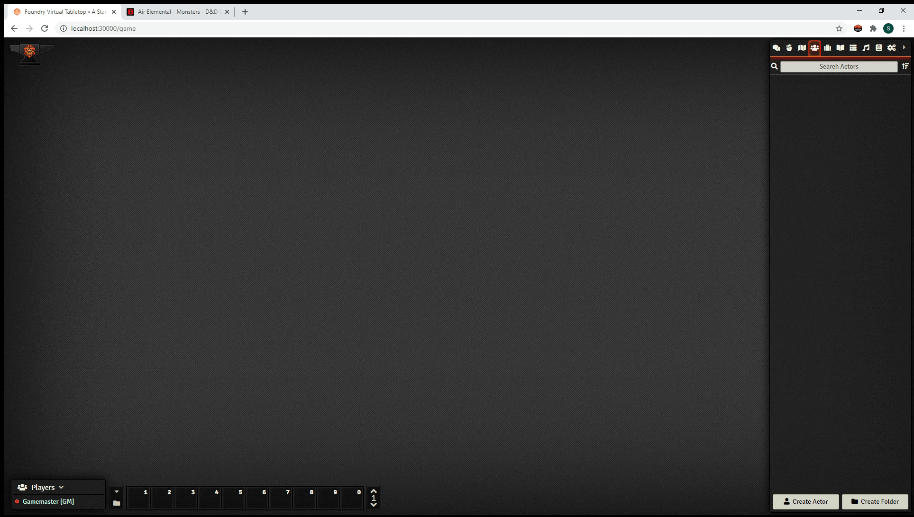
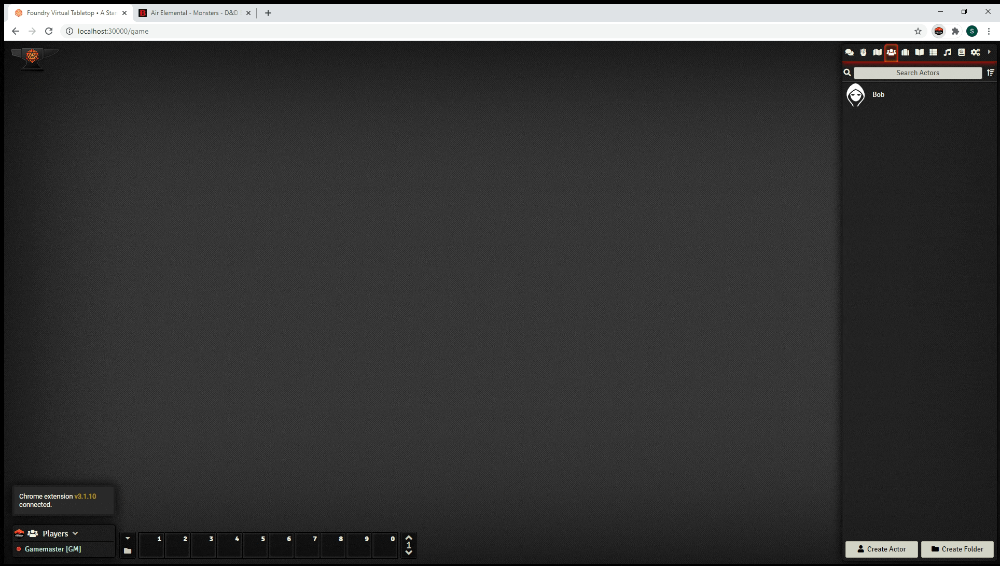

# Item Icon Updater
A Foundry VTT Module for updating icons with missing images based on the D&amp;D5e SRD icons.

Updates some icons for actions and other items with missing icons. This is particularly useful in conjunction with VTTA D&D Beyond Integration. Searches all items from all actors in the current world for missing icons. These item names are compared first to a curated list of images, then to user-defined items in the game, and finally across all compendiums in the game. If a matching name is found, the item icon will be updated.

Icons for tokens already existing on the map are not updated - a new token must be brought in from the actor.

The updates happen automatically when the page reloads, when a new Actor is created, and when an Item is created or has its name updated.

## Installation
1. Copy this link and use it in Foundry's Module Manager to install the Module

    > https://raw.githubusercontent.com/kelsa-gm/item-icon-updater/main/module.json
    
2. Enable the Module in your Worlds Module Settings

## Usage
Create new items. If the name is recognized, the icon will automatically be assigned:


Icons are automatically updated when importing from D&D Beyond using the VTTA module:


## Custom Dictionary
The user may optionally specify a custom dictionary of item names and icon files. If specified, these will override the default icons. Default icons will still be used for items not included in the custom dictionary. 

Updates to the custom dictionary in the module settings take effect after the next page refresh. 

The following rules are used when searching for item names:
* Item names are case sensitive (so "Bite" works, but "bite" does not). 
* Any character after the first open parentheses is ignored. This trims off suffixes such as "(Hybrid Form Only)" or "(Costs 2 Actions)".
* Any leading or trailing whitespace is ignored.

Note that different sources may use different names for items, such as "Crossbow, Light" vs "Light Crossbow". The custom dictionary can be used to catch these cases. Additionally, the built-in dictionary will gradually be extended in future updates to include more of these cases.

To specify a custom dictionary, put the dictionary file in the User Data directory, and add the path to the module settings. For example: `worlds/myworld/iconDictonary.js`.  The custom dictionary should be a text file with a `.js` extension in the following format:

```
export const customDict = {
    "Item Name 1": "path/to/icon1.jpg", 
    "Item Name 2": "path/to/icon2.jpg"
}
```
### Icon Libraries
Foundry 0.7.x includes a built-in library of icons that can be used by the custom dictionary. These can be viewed in the installation folder, typically `C:\Program Files\FoundryVTT\resources\app\public\icons`. To reference these icons in a custom dictionary, use the path `../../icons/`.

If the dnd5e system is installed, an additional library of icons is available. These can be viewed in the User Data folder under `systems/dnd5e/icons/`. To reference these icons in a custom dictionary, use the path `systems/dnd5e/icons/`.

## Future Work
1. Create an updated icon dictionary using the new icons provided in Core 0.7x. 
2. Make the lookup values case insensitive.

## Acknowledgements
Thanks to [VanceCole](https://github.com/VanceCole) for the helpful suggestions.


## Collaboration
Anyone who wants to use this as a starting point for a more robust module is welcome to!
